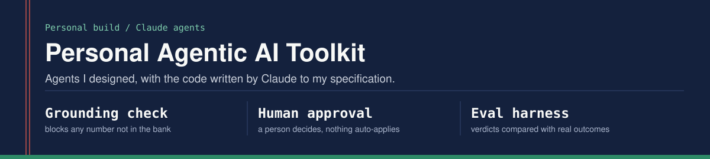
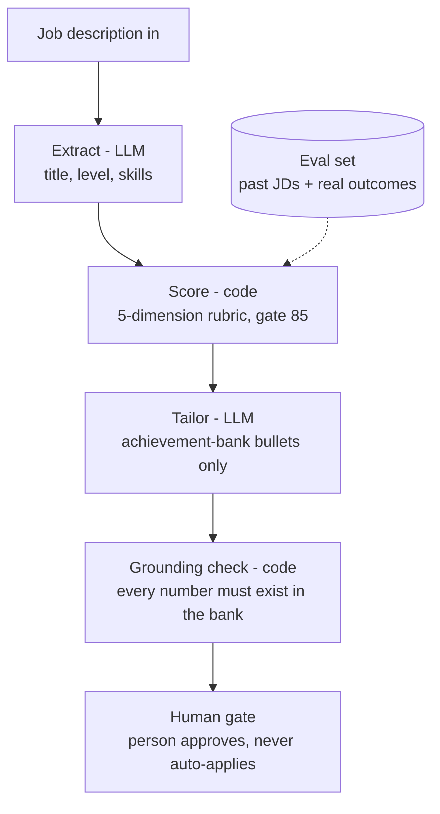

<p align="center"></p>

Personal AI agents I designed and built with Claude. The first one is a **job-fit agent**: it reads a
job description, scores it against a fixed rubric, drafts resume bullets using only
facts from an achievement bank, blocks any draft that contains an unverified number,
and hands the final decision to a person.

## Who built what

I designed these agents: the pipeline, the scoring rubric, the grounding rule, the human gate,
the evaluation approach and the prompts. Claude, an AI assistant, wrote the code to my
specification. I direct the build at the design and requirements layer, and I do not write or review application code.

## What is in this repository

| Folder | What it holds |
|---|---|
| `job_fit_agent/`, `evals/`, `examples/`, `data/` | The job-fit agent described below: running code, an eval harness and an offline demo |
| `resume-pipeline/` | The build-and-verify checks for one-page resume PDFs, with the documented failure modes |
| `job-search-agent/` | Design notes and the scoring rubric for the wider multi-user job-search agent |
| `shopping-insights-agent/` | Design notes and prompt patterns for a personal purchase-history agent |

## Job-fit agent



## Design decisions

| Decision | Why |
|---|---|
| LLM for extraction and drafting only | Reading free-text JDs and writing are fuzzy tasks where a model helps |
| Plain code for scoring | A score must return the same answer twice and be explainable line by line |
| Grounding check as a blocking gate | An invented metric on a resume is the worst failure; it is caught before a person sees the draft |
| Human gate, no auto-apply | Unfiltered auto-apply produced off-target applications; the agent recommends, a person decides |
| Cheap model to extract, stronger model to write | Cost per JD stays low; quality goes where it is visible |
| Real bank kept out of the repo | `data/my_bank.md` is in `.gitignore`; only a format example is public |

## Evaluation

`evals/run_evals.py` runs the agent over past job descriptions and compares its verdict
with the decision actually made and the real outcome (interview, rejected, no response).

It reports:
- **Agreement** - how often the agent's GO/NO-GO matches the human decision
- **False GO on rejections** - the costly error: the agent says apply, the market said no
- **Instability** - with `--repeat 3`, how often extraction variance flips the verdict
- **Tokens** - to estimate cost per JD

## Known limits

- The grounding check verifies that each number exists in the bank, not that it is attached
  to the right claim. A real number reused for the wrong achievement would pass.
- Scoring weights are hand-set, not learned. The eval set is how they get tuned.
- Extraction can vary run to run; the score is only as stable as the fields it receives.

## Run it

```
pip install -r requirements.txt
python -m job_fit_agent.agent examples/sample_jd.txt --offline   # no API key needed
python -m job_fit_agent.agent path/to/jd.txt                     # live, needs ANTHROPIC_API_KEY
python evals/run_evals.py --repeat 3                            # live eval
```

The offline example deliberately contains one invented number (35%) so you can see the
grounding check block it.

## Layout

```
job_fit_agent/
  llm.py        the only file that calls a model
  extract.py    box 2 - LLM extraction to fixed fields
  score.py      box 3 - rubric in plain code
  tailor.py     box 4 - bank-grounded drafting
  grounding.py  box 5 - number check, blocks ungrounded drafts
  gate.py       box 6 - human decision, logged for evals
  agent.py      runs the pipeline
evals/          eval harness and eval set
data/           profile, example bank (real bank stays local)
examples/       saved outputs for the offline demo
```

MIT licensed.
